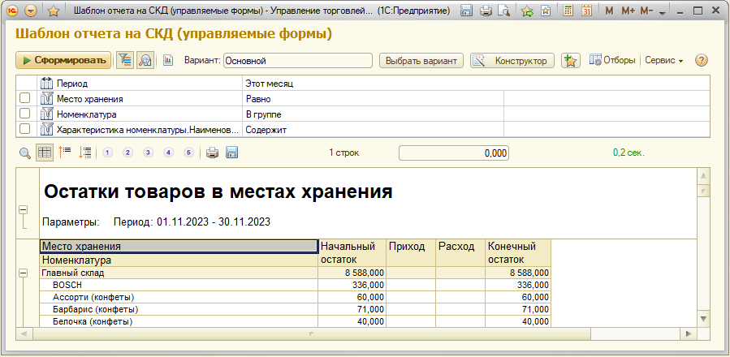
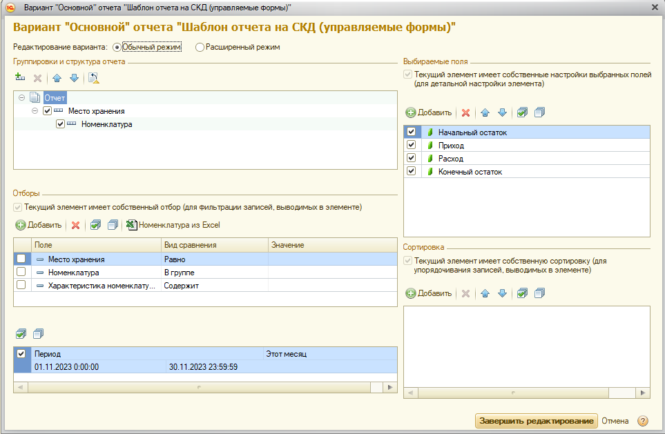

# Упрощенная форма редактирования настроек СКД на управляемых формах

[Скачать](https://github.com/kuzyara/ManagedFormesReports/raw/main/ManagedFormesReports.dt)

Статья: https://infostart.ru/1c/tools/1891044/

Предоставляет простой интерфейс для настройки отчетов на СКД

4 общие формы:

УниверсальнаяФормаОтчета

УниверсальнаяФормаНастроекОтчета

УниверсальнаяФормаВариантаОтчета

ФормаВыбораВариантаОтчета
- Панель быстрых отборов
- Панель дополнительного функционала с управлением уровнем группировок:
- Упрощенный вариант настроек компоновщика
- Загрузка настроек любого пользователя
Код не мой.

